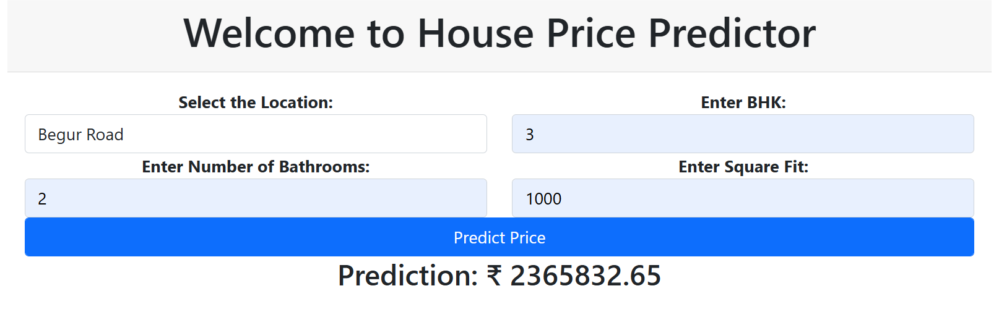

# Bengaluru House Price Predictor

A machine learning web application that predicts residential property prices in Bengaluru based on location, size, and other key features. Built with a Ridge Regression model and served via a Flask REST API.



---

## Table of Contents

- [Overview](#overview)
- [Demo](#demo)
- [Features](#features)
- [Tech Stack](#tech-stack)
- [Dataset](#dataset)
- [Project Structure](#project-structure)
- [Installation](#installation)
- [Usage](#usage)
- [Model Details](#model-details)
- [API Reference](#api-reference)
- [Future Improvements](#future-improvements)
- [License](#license)

---

## Overview

This project uses real estate data from Bengaluru to train a Ridge Regression model that estimates house prices. Users can input a location, number of BHKs, number of bathrooms, and total square footage to get an instant price prediction through a clean web interface.

---

## Demo

> Enter the location, BHK, bathrooms, and square footage → click **Predict Price** → get an instant estimate in ₹.


---

## Features

- Supports **242 unique locations** across Bengaluru
- Accepts custom square footage input
- Configurable BHK and bathroom count
- Real-time price prediction via Flask API
- Pre-processed and cleaned dataset for accurate results

---

## Tech Stack

| Layer | Technology |
|---|---|
| Frontend | HTML, CSS |
| Backend | Python, Flask |
| ML Model | scikit-learn (Ridge Regression) |
| Data Processing | Pandas, NumPy |
| Model Serialization | Pickle |
| Notebook | Jupyter Notebook |

---

## Dataset

**Source:** Bengaluru House Data (`Bengaluru_House_Data.csv`)

| Attribute | Details |
|---|---|
| Raw Records | 13,320 |
| Cleaned Records | 7,361 |
| Features Used | `location`, `total_sqft`, `bath`, `bhk` |
| Target Variable | `price` (in Lakhs ₹) |
| Unique Locations | 242 |

The raw dataset includes features like `area_type`, `availability`, `society`, `balcony`, and `size`, which were cleaned and reduced to the most predictive features.

---

## Project Structure

```
HousePricePredictor/
│
├── Bengaluru_House_Data.csv   # Raw dataset
├── Cleaned_data.csv           # Preprocessed dataset
├── HousePricePredictor.ipynb  # Data cleaning, EDA & model training notebook
├── RidgeModel.pkl             # Serialized trained Ridge Regression model
├── main.py                    # Flask application
├── predict.png                # App screenshot
│
└── templates/
    └── index.html             # Frontend UI
```

---

## Installation

### Prerequisites

- Python 3.8+
- pip

### Steps

1. **Clone the repository**
   ```bash
   git clone https://github.com/your-username/HousePricePredictor.git
   cd HousePricePredictor
   ```

2. **Install dependencies**
   ```bash
   pip install flask scikit-learn pandas numpy pickle-mixin
   ```

3. **Run the application**
   ```bash
   python main.py
   ```

4. **Open your browser** and navigate to:
   ```
   http://127.0.0.1:5000
   ```

---

## Usage

1. Select a **location** from the dropdown (242 Bengaluru localities available).
2. Enter the number of **BHKs** (bedrooms).
3. Enter the number of **Bathrooms**.
4. Enter the **Total Square Footage**.
5. Click **Predict Price** to get the estimated property price in ₹.

---

## Model Details

| Parameter | Value |
|---|---|
| Algorithm | Ridge Regression |
| Library | scikit-learn |
| Input Features | `location`, `total_sqft`, `bath`, `bhk` |
| Output | Predicted price in ₹ (converted from Lakhs) |
| Serialization | `pickle` (`.pkl`) |

The full model training pipeline — including data cleaning, feature engineering, outlier removal, and model evaluation — is documented in `HousePricePredictor.ipynb`.

---

## API Reference

### `GET /`

Returns the main prediction form with all available locations loaded.

### `POST /predict`

Accepts form data and returns the predicted price as a plain string.

**Request Parameters:**

| Field | Type | Description |
|---|---|---|
| `location` | string | Locality name in Bengaluru |
| `bhk` | integer | Number of bedrooms |
| `bath` | integer | Number of bathrooms |
| `total_sqft` | float | Total area in square feet |

**Response:**

```
2365832.65
```
*(Predicted price in ₹)*

---

## Future Improvements

- [ ] Add more ML models (Lasso, Random Forest, XGBoost) and compare performance
- [ ] Deploy to cloud (Heroku / Render / AWS)
- [ ] Improve UI with a modern frontend framework (React / Tailwind CSS)
- [ ] Add input validation and error handling on the frontend
- [ ] Display confidence intervals alongside predictions
- [ ] Add a price trend chart per location

---

> Built with using Python, Flask, and scikit-learn.
